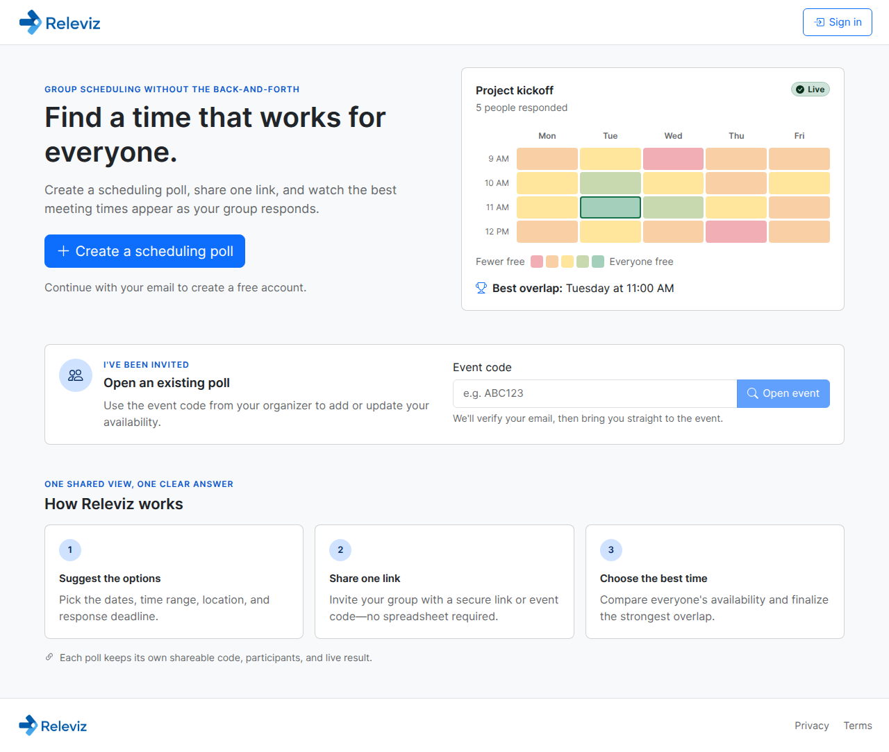

# Releviz

A group meeting planning app with weighted availability and real-time aggregation. Create an event, share the link, and find the best time for everyone.



## How to Use

### 1. Create an Event

Go to the home page and fill out the event form:

- **Event Name** — give your meeting a title
- **Meeting Type** — In-Person (requires a location) or Virtual
- **Time Range** — set 15- or 30-minute slots; an earlier end time creates an overnight window
- **Days** — pick which days of the week are options (defaults to Mon-Fri)

Create an account or log in before creating an event. After creating, you'll be redirected to the organizer view.

### 2. Share the Link

Click **Copy Share Link** in the top-right corner to get a link like:

```
https://yoursite.com/event?code=j9eaFNJH
```

Send this to everyone who should participate. Everyone who opens the link logs in before viewing the event or submitting availability.

### 3. Participants Fill In Availability

Each participant:

1. Signs in and clicks **Join**
2. Uses the **Availability Slider** to pick a level (0 = Busy, 1 = Free, with 0.25 steps)
3. Clicks, drags, touches, or uses the keyboard on the **schedule grid** to paint 15- or 30-minute
   slots with that availability level
4. Clicks **Submit Schedule** when done

The grid uses color coding: red (busy) -> yellow (partial) -> green (free).

After submitting, participants can see the **Group Availability** table showing aggregated scores, plus each person's **Individual Schedule** below it.

### 4. Organizer Dashboard

Access the organizer view from the account that created the event. The organizer can:

- **Set their own availability** on the same grid
- **Send email invitations and deadline reminders** with calendar attachments
- **Adjust participant weights** (0.0-1.0) — higher weight means more influence on the group average
- **Include/exclude participants** from the aggregate calculation
- **Remove participants** from the event
- **View the weighted group average** in real time, updated as weights change

The weighted average formula: for each time slot, `sum(availability * weight) / sum(weights)` across all included participants.

## Tech Stack

| Layer          | Technology                                                                          |
| -------------- | ----------------------------------------------------------------------------------- |
| Frontend       | [Next.js 15](https://nextjs.org/) (App Router) + React 18 + Material Web components |
| Backend        | [Django 5](https://www.djangoproject.com/) + DRF + SimpleJWT                        |
| Database       | PostgreSQL/RDS in deployed environments; SQLite for local development               |
| Infrastructure | AWS ECS Fargate behind ALB (path-based routing)                                     |
| IaC            | Terraform (versioned encrypted S3 state with native lock files)                     |
| CI/CD          | GitHub Actions (required CI; production CD temporarily disabled)                      |

## Project Structure

```
releviz-monorepo/
  frontend/         # Next.js 15 — UI only, no API routes
  backend/          # Django — API server, account auth, admin
  infra/
    prod/           # HA production Terraform (split frontend/backend services)
    bootstrap/      # Protected state backend and GitHub OIDC deploy role
  scripts/
    quality-gate.sh # Full lint + test + build for both workspaces
  .github/workflows/
    ci.yml          # Parallel CI for both workspaces
    deploy-prod.yml.disabled # Non-runnable CD marker during PR consolidation
```

## Local Development

```bash
npm install          # install all workspace dependencies
python3 -m pip install -r backend/requirements/local.txt
npm run dev          # start backend (4000) + frontend (3000)
npm run dev:backend  # backend only
npm run dev:frontend # frontend only
```

The frontend proxies `/api/*` and `/authn/*` requests to `http://localhost:4000` in dev via `next.config.js` rewrites.

Run checks:

```bash
npm --workspace=backend run lint
npm --workspace=frontend run lint
python backend/src/manage.py test --settings=config.settings.test
npm --workspace=backend run test
npm --workspace=frontend run test
npm --workspace=frontend run build
npm run quality-gate               # all of the above
```

Pull requests use diff-scoped GitHub Actions jobs for the backend, frontend, E2E, and Terraform
areas. Every push to `main` runs the full suite and produces one stable `CI Result` check. The
pipeline includes workflow/configuration preflight checks, strict aggregate
backend coverage, PostgreSQL migration and app tests, frontend coverage and bundle budgets,
dependency/secret/SAST scans, SBOM and license reports, Terraform tests, and Docker image scans.
Chromium, Firefox, and WebKit E2E runs and high/critical container findings block `CI Result`.
The workflow runs for every pull request, including documentation-only changes, so branch
protection always receives the same required check.

## Runtime Environment Variables

### Backend

- `PORT` (default: `4000`)
- `DJANGO_SETTINGS_MODULE` (local default: `config.settings.local`, deployed default: `config.settings.production`)
- `DJANGO_SECRET_KEY`
- `DJANGO_FIELD_ENCRYPTION_KEY` — encrypts AWS SES IAM secrets and queued authentication-email
  content
- `DJANGO_ALLOWED_HOSTS`
- `FRONTEND_URL`
- `BACKEND_URL`
- `CORS_ALLOWED_ORIGINS`
- `CSRF_TRUSTED_ORIGINS`
- `DB_NAME`
- `DB_USER`
- `DB_PASSWORD`
- `DB_HOST`
- `DB_PORT` (default: `5432`)
- `DJANGO_CREATE_DEFAULT_ADMIN` (`1` to run default admin bootstrap at container start)
- `DJANGO_SUPERUSER_EMAIL`
- `DJANGO_SUPERUSER_PASSWORD`
- `USE_SES_EMAIL_PROVIDER` (`1` in deployed environments; local/test email backends bypass SES)
- `REQUIRE_ENCRYPTED_PASSWORDS` (`1` by default in production; password-bearing API requests
  negotiate the active RSA public key and use RSA-OAEP/SHA-256)
- `AUTH_TRUSTED_PROXY_COUNT` (number of trusted proxies used to resolve the client IP; production
  defaults to `1`)
- `METRICS_BEARER_TOKEN` (required in production; dedicated credential for the private product
  metrics endpoint)
- `FEEDBACK_SUBMISSION_RETENTION_DAYS` (default: `730`; scheduled deletion boundary for feedback
  text)
- `APP_LOG_LEVEL` (default: `INFO`; structured JSON application log threshold)
- `SENTRY_DSN` (optional; external error tracking remains disabled when empty)
- `SENTRY_ENVIRONMENT`
- `SENTRY_RELEASE` (use an immutable image digest or Git revision)
- `SENTRY_TRACES_SAMPLE_RATE` (default: `0.05`, range `0` through `1`)

### Frontend

- `NEXT_PUBLIC_API_BASE_URL` — API base URL (empty = relative paths via proxy)
- `BACKEND_URL` — dev proxy target (default: `http://localhost:4000`)

Authentication is handled by the Django backend using email/password accounts, email verification
codes, short-lived in-memory JWT access credentials, an `HttpOnly` refresh cookie bound to a
revocable server session, browser-side public-key encryption when required by the deployment,
account recovery and session controls, and a Django/Unfold admin at `/admin/`. See
[`docs/auth-security.md`](docs/auth-security.md).

Availability uses backend-authored 15/30-minute slot groups with explicit timezone and DST
semantics. See [`docs/scheduling-slots.md`](docs/scheduling-slots.md).

Email delivery is configured in Django admin under **Email Delivery**. Authentication messages,
final notifications, invitations, and reminders use persisted retryable jobs. Add an active AWS SES
provider with region, sender email, IAM access key id, and IAM secret access key. Provider secrets
and queued authentication content are encrypted in the database and are not stored in Terraform or
GitHub secrets. SES identities/domains and IAM permissions must already be configured in AWS.

Operational procedures and product evidence definitions:

- [`docs/observability.md`](docs/observability.md)
- [`docs/product-analytics.md`](docs/product-analytics.md)
- [`docs/backup-restore.md`](docs/backup-restore.md)
- [`docs/deployment-rollback.md`](docs/deployment-rollback.md)
- [`docs/real-user-validation-plan.md`](docs/real-user-validation-plan.md)

## Docker

```bash
# Backend
docker build -t releviz-backend:local ./backend
docker run --rm -p 4000:4000 \
  -e DJANGO_SETTINGS_MODULE=config.settings.local \
  releviz-backend:local

# Frontend
scripts/docker-build-frontend.sh releviz-frontend:local
docker run --rm -p 3000:3000 releviz-frontend:local
```

## Deployment

### Production

Production CD is intentionally disabled while the open pull-request backlog is consolidated.
There is no runnable production workflow and no workflow currently grants deployment or OIDC
permissions. Terraform still describes the production infrastructure, but it must not be applied
through GitHub Actions until CD is deliberately rebuilt, reviewed, and protected. The previous
manual workflow remains recoverable from Git history for reference only. After consolidation,
rebuild the release workflow and re-review the procedure in
[`docs/deployment-rollback.md`](docs/deployment-rollback.md) before any live release.

Run `infra/bootstrap` once with an administrator to create the versioned state bucket and the
repository/environment-scoped OIDC role. Supply the existing account-wide GitHub OIDC provider ARN;
bootstrap never creates or deletes that shared provider. Initialize with `-backend=false` for the
first apply, then migrate the local bootstrap state to `bootstrap/terraform.tfstate` in the new
bucket. Set its `production_deploy_role_arn` output as `AWS_PROD_ROLE_ARN`; do not store long-lived
production AWS keys in GitHub.

### GitHub Actions Variables

- `AWS_REGION` — `us-west-2`
- `AWS_PROD_ROLE_ARN` — output of `infra/bootstrap`; trusted only for the `Production` Environment
- `PROD_TF_STATE_BUCKET` — protected state bucket created by `infra/bootstrap`
- `ECR_PROD_BACKEND` — `releviz-prod-backend`
- `ECR_PROD_FRONTEND` — `releviz-prod-frontend`
- `PROD_DOMAIN` — `releviz.com`
- `PROD_ROUTE53_ZONE_ID` — hosted-zone ID for `releviz.com`
- `PROD_DJANGO_SECRET_KEY_ARN`, `PROD_DJANGO_FIELD_ENCRYPTION_KEY_ARN`, and
  `PROD_METRICS_BEARER_TOKEN_ARN` — Secrets Manager ARNs, not secret values
- `PROD_ALARM_ACTION_ARNS_JSON` — non-empty JSON array of monitored SNS topic ARNs
- `PROD_SENTRY_DSN_SECRET_ARN`, `PROD_SECRET_KMS_KEY_ARN`, and
  `PROD_ACM_CERTIFICATE_ARN` — optional
- `PROD_DEFAULT_FROM_EMAIL` — verified production sender address

Staging was permanently retired. Production application secret values live in AWS Secrets Manager;
GitHub holds only their ARNs in the protected `Production` Environment.
